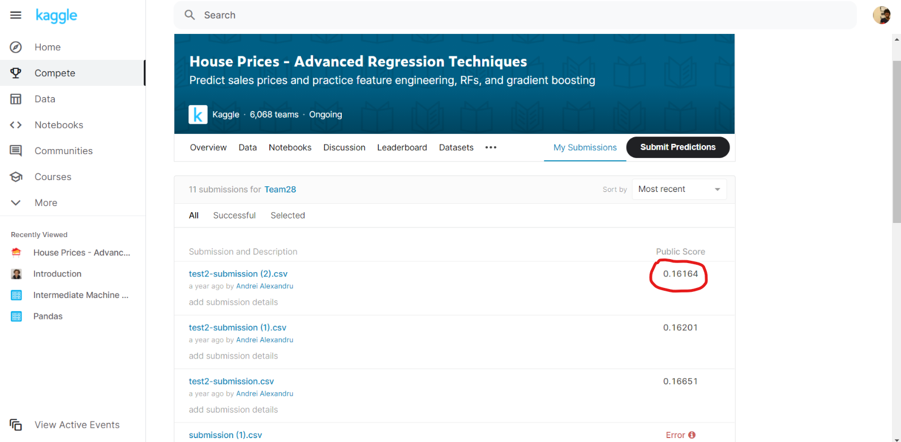
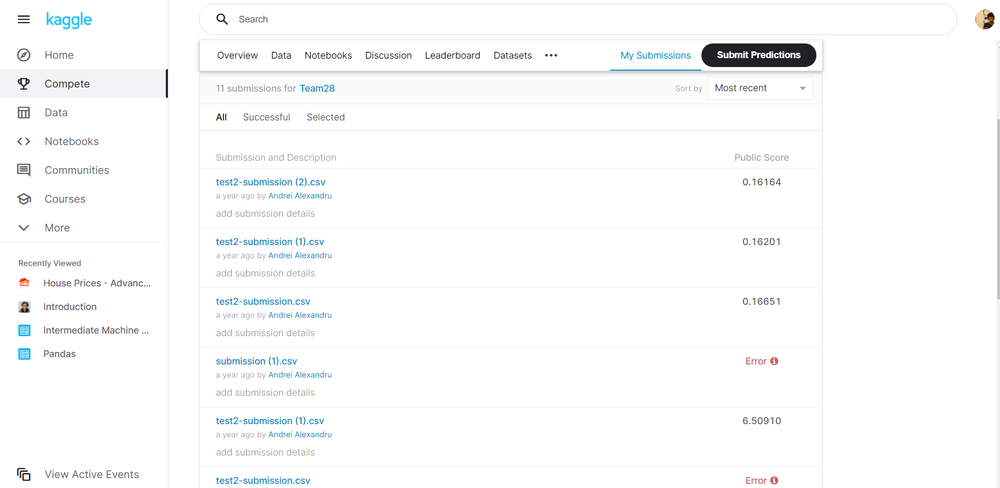
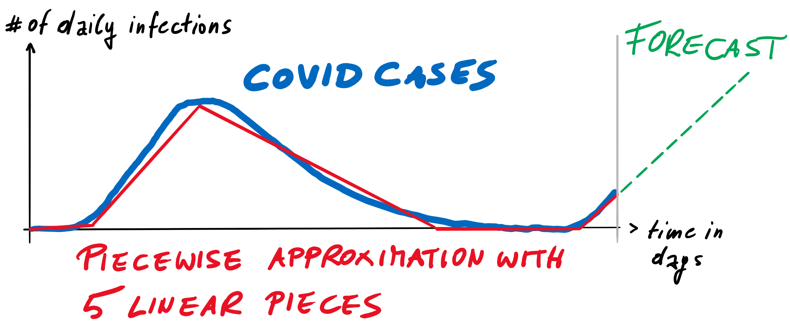

# Sanskar Gupta   
- - -
T: (+44) 07459440712 / (+91) 9920068513  
[Gmail](sanskargupta15@gmail.com)   
[LinkedIn](https://www.linkedin.com/in/sanskargupta/)   
[Github](https://github.com/Sanskar-16)  
[Gitlab](https://cseegit.essex.ac.uk/sg19794)  
[Kaggle](https://www.kaggle.com/sg19794)

---
## Personal profile    
I am a BSc Data Science student, looking for a placement/internship opportunity. I have dedicated much of my life to community support work and have excellent customer service skills as a result of being a good communicator. I speak three languages and I have extensive programming skills, which I enjoy using for open-sourced coding projects. I have worked on lots of volunteering projects and various jobs throughout my studies at the university.

---
## Education 

### BSc Data Science - University of Essex (2019 - 2023) 
**First year modules**
- Introduction to programming
- Introduction to databases
- Calculus
- Discrete Mathematics
- Statistics I
- Team project Challenge (Kaggle housing project)(Machine Learning)
- Object oriented programming 

*Grade Recieved - 1st (73%)*

**Second year modules**
- Artificial Intelligence 
- Databases and Information retrieval
- Complex numbers and Matrices
- Statistics II
- Team project challenge (Covid-19 prediction using various regression techniques)
- Math career and employability.
- Data structure and algorithms
- Optimisation (Linear programming)

### A-levels or equivalent - Delhi Public School (2017 - 2019)
**Subject Undertaken**
- Physics 
- Maths
- Chemistry 
- English 
- Computer Science 
- Physical Education 

*Grade Recived - 89% (A)*

* * * * * * * *
## Projects worked on 
### 1. Kaggle Housing project 

- This project was based on prediction of the housing prices. The attibutes which define the price in a certain way were given, One had to get the right attributes together and remove the ones which alter the price in negative way to predict the prices in the most accurate manner. I did this project with a team of six other members, We all achieved a score of 0.16164 as the best score. 

- Language used - python

### 2. A COVID-19 modeling and forecast tool 

Language used - Java, HTML. 

**You can turn on push notifications to keep in touch with my projects**

*******
## Work experience

### Resident’s Assistant (October 2020 – Current)
University of Essex							
- Creating a sense of community through social opportunities and befriending.
- Facilitating flat agreements, problem solving and dialogue within student accommodation using negotiation and listening skills. 
- Building inclusive residential and campus wide communities and assist in the creation of an environment in which students not only live and learn but also grow.
- Creative thinking to come up with programmes with social values for residents.

### Support Worker	(February 2020 – Current)
Lifeways – Living Ambitions
- Working as a support worker by helping the service users carry out their day-to-day task.
- Being punctual to relieve colleagues from previous shifts.
- Responsibly help them take their medications correctly and on time.
- Make food with/for them, helps me learn about different people and their interests.
- Working part time as and when needed by the services I am listed under. Keeps me determined to work better and harder every day.

### Session Leader (October 2019  – Current)
University of Essex - VTeam
- Working as a session leader for the animal rescue project on alternate weekends.
- Take attendance on volunteers’ arrival and make sure everyone reaches safely.
- Working as a volunteer on other on and off projects and regular projects.

### Accommodation representative (October 2019 – July 2020)
University of Essex
- Maintain my own room to show it as a model room for visiting parents and new students.
- Fill in timesheets in a particular time frame to get paid for the shifts held.

### Volunteer (October 2019 - Jul 2020)
University of Essex – Nightline
- Confidential listening and support service run by the students for the students at the university.
- Basic first aid/bystander trained.

### Team Member	(May 2019 - August 2019)
Theobroma - Food of the Gods
- Worked as a Team Member to provide quality service.
- Coordinated with the team to deliver in the best interest of the customer.
- Well Experienced in waiting tables, closing shift, managing orders.
- Responsibly handle cash whenever needed.
- Converse with customers for feedback on the service provided and how can it be improved.

### Volunteer (April 2017 - June 2017)
The Akanksha Foundation
- Worked as a Volunteer to align the HR activities in MS Excel during appraisals.
- Helped the team with Employee data and MIS.
- Coordination with the HR team and field Volunteer for organizing an annual day.

***
## Positions of responsibility

### Vice-President – Cycling club (October 2020 – Current)
University of Essex
- Manage the internal working of the club such as and assist the president where necessary.
- Act as secondary point of contact for external bodies.

### Essex Student representative (December 2019 – July 2020)
University of Essex
- Student representative for mathematical Sciences department’s modules.
- Gather feedback from students via email, WhatsApp for different modules.
- Communicate efficiently with higher authorities to convey the feedback.

---
## Skills:
- Languages Known: English, Hindi, Spanish (Beginner)
- Git, Python, MySQL, R, MATLAB, AI, Java, Machine Learning, HTML, Statistics, C++, Jira.
- Conversant with Windows, Mac, MS office & Internet-based applications.

---
## Interests and Activities
- Working and improvising on open-sourced coding – participated in Kaggle housing project, Covid prediction model.
- Participating in sports and fitness – helps me keep active and a good physique. I'm passionate about football.
- Listening and working with Music and beats – keeps me relaxed. I play intruments too (keyboard and drums).
- Cycle touring – explore nearby areas, go for long rides.
- Mobile/Console gaming – I participate in local tournaments for CODM, helps me concentrate, keeps me aware and meet new people with same interest.

---
## Reference available on request
