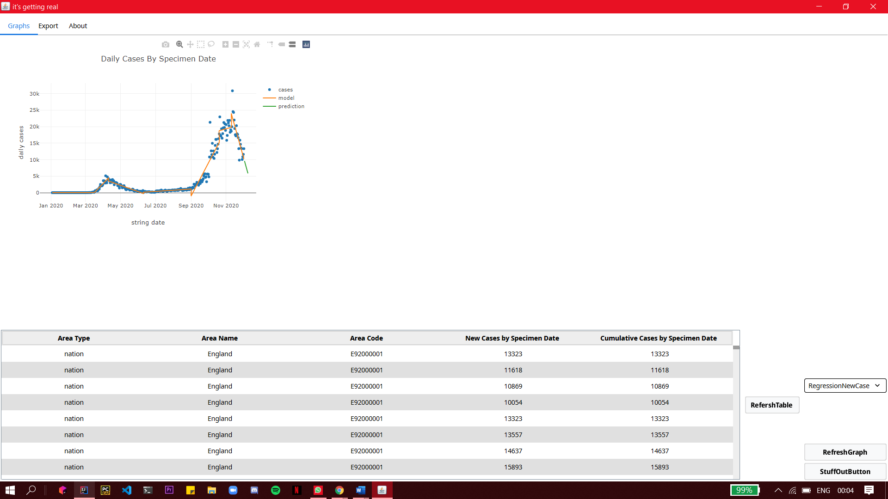
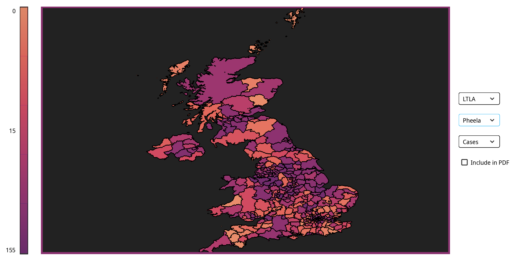
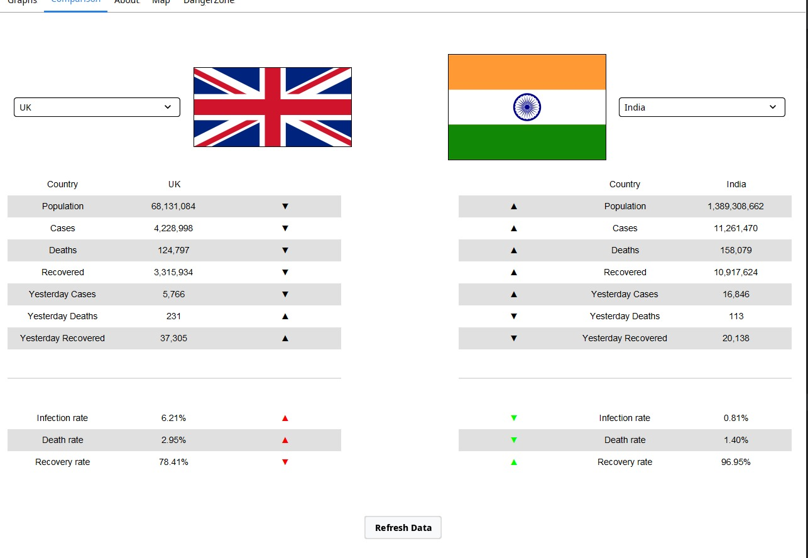

# Sanskar Gupta   
T: (+44) 07459440712 / (+91) 9920068513  
[Gmail](sanskargupta15@gmail.com)/ 
[LinkedIn](https://www.linkedin.com/in/sanskargupta/)/
[Github](https://github.com/Sanskar-16)/
[Gitlab](https://cseegit.essex.ac.uk/sg19794)/
[Kaggle](https://www.kaggle.com/sg19794)

---
## Personal profile    
I am a BSc Data Science student, looking for a placement/internship opportunity. I have dedicated much of my life to community support work and have excellent customer service skills as a result of being a good communicator. I speak three languages and I have extensive programming skills, which I enjoy using for open-sourced coding projects. I have worked on lots of volunteering projects and various jobs throughout my studies at the university.

---
## Education 

### BSc Data Science - University of Essex (2019 - 2023) 
**First year modules**
- Introduction to programming
- Introduction to databases
- Calculus
- Discrete Mathematics
- Statistics I
- Team project Challenge (Kaggle housing project)(Machine Learning)
- Object oriented programming 

*Grade Recieved - 1st (73%)*

**Second year modules**
- Artificial Intelligence 
- Databases and Information retrieval
- Complex numbers and Matrices
- Statistics II
- Team project challenge (Covid-19 prediction using various regression techniques)
- Math career and employability
- Data structure and algorithms
- Optimisation (Linear programming)
- Survival analysis

### A-levels or equivalent - Delhi Public School (2017 - 2019)
**Subject Undertaken**
- Computer Science 
- Physics 
- Maths
- Chemistry 
- English 
- Physical Education 

*Grade Recived - 89% (A)*

* * * * * * * *
## Projects worked on 
### 1. Kaggle Housing project 

- This project was based on prediction of the housing prices. The attibutes which define the price in a certain way were given, One had to get the right attributes together and remove the ones which alter the price in negative way to predict the prices in the most accurate manner. I did this project with a team of six other members, We all achieved a score of 0.16164 (RMSE) as the best score.  
- RMSE also knows as Root mean square error is the deviation of the residuals, Residals are a meausre of how far from the regression line data points are.

- Language used - python

### 2. A COVID-19 modeling and forecast tool  

  

### Sanskar Gupta

### Sprint 1 (University Week 4):

- [Familiarise with command-line cseegit](https://cseejira.essex.ac.uk/browse/A291002-14)The task was to understand basic git commands for easier navigation using command-line, push and commit my work and pull other's commits. It was completed successfully in 4 hours. [Gitlab commit](https://cseegit.essex.ac.uk/2020_ce291/ce291_team02/-/blob/master/collaboration%20ver2.txt)

### Sprint 2 (University Week 5-6):

- [Create a MySQL database with schema](https://cseejira.essex.ac.uk/browse/A291002-60) One of the few Jira issues that I needed to do for this sprint was a subtask to create a MySQL with the schema. This took me an hour to complete. [Permalink](https://cseegit.essex.ac.uk/2020_ce291/ce291_team02/-/blob/c7ecfaa78fab7d9da990bc16b2a152ec38e047df/src/database/covid_mft_db_creation_script_V1.sql)

- [Create Hello world file in java](https://cseejira.essex.ac.uk/browse/A291002-26) Create a 'Hello World' file in java. This task was completed in an hour. [Permalink](https://cseegit.essex.ac.uk/2020_ce291/ce291_team02/-/blob/master/src/csee/ce291_team02/Main.java)

- [File manipulation](https://cseejira.essex.ac.uk/projects/A291002/issues/A291002-63?filter=reportedbyme) Create a java class that reads, writes and exports the df file used for graphs and metrics. Nasar and I worked on this and it took us around an hour to complete. Later on, it was decided that it won't be used as a better alternative was found. [Permalink](https://cseegit.essex.ac.uk/2020_ce291/ce291_team02/-/blob/d85b2e6c846153f3e434505af3b2cf158c086427/src/File%20Manipulation/File%20manipulation%20eperiment/src/FileManipulation/CreateFile.java)

### Sprint 3 (University Week 7-8):

- [Implement piecewise linear regression](https://cseejira.essex.ac.uk/browse/A291002-156) Implement piecewise linear regression by including hardcoded knots and use it in our displayed and exported graphs. It was not my main task, I assisted Filip with this particular task. We worked around for 4 hours roughly to get it done.  [Permalink](https://cseegit.essex.ac.uk/2020_ce291/ce291_team02/-/blob/A291002-290-country-comparison-adaptation/src/covid-mft-desktop-jv/src/main/java/csee/ce291_team02/MugStats/Regression/PclRegression.java)

### Sprint 4 (University Week 9-10):

- [Requirements and risk log](https://cseejira.essex.ac.uk/browse/A291002-136) Worked around 2 hours completing the risk and requirements log for the MVP documentation. Identifying all the risks when the program runs.

- [Product demonstration report](https://cseejira.essex.ac.uk/browse/A291002-143) Completed the MVP demonstration along with Dean. We spent around an hour 

  

### Sprint 5 (University Week 11-12):

- [Research for feature proposal](https://cseejira.essex.ac.uk/browse/A291002-40) My task was to research the extra features which could be added to the product to improve its value. [Permalink](https://cseegit.essex.ac.uk/2020_ce291/ce291_team02/-/tree/master/src/covid-mft-desktop-jv/src/main/java/csee/ce291_team02/ColourCodedMap)

### Sprint 6 (University Week 17-18):

- [Feature proposal](https://cseejira.essex.ac.uk/browse/A291002-173) Pitched in the idea for extra features which could be added to the product. I suggested a colour-coded map and a FAQ tab. [Permalink](https://cseegit.essex.ac.uk/2020_ce291/ce291_team02/-/tree/master/src/covid-mft-desktop-jv/src/main/java/csee/ce291_team02/ColourCodedMap)

### Sprint 7 (University Week 19-20):

- [Research on Colour-coded map](https://cseejira.essex.ac.uk/browse/A291002-205) Looked for details on how to show a map segregated by colours based on case density of the various regions. This task took me 5 hours to find out everything. [Permalink](https://cseegit.essex.ac.uk/2020_ce291/ce291_team02/-/tree/master/src/covid-mft-desktop-jv/src/main/java/csee/ce291_team02/ColourCodedMap)

### Sprint 8 (University Week 21):

- [Plan for Color-coded map](https://cseejira.essex.ac.uk/browse/A291002-260) Spent around 2h 30m on planning the implementation of the colour-coded map along with Filip. [Permalink](https://cseegit.essex.ac.uk/2020_ce291/ce291_team02/-/tree/master/src/covid-mft-desktop-jv/src/main/java/csee/ce291_team02/ColourCodedMap)

- [Working on Colour-coded map](https://cseejira.essex.ac.uk/browse/A291002-261) Created a package for the classes required for the colour-coded map, sorted through classes, made sure the imports were properly organized. Attempted to render the basic map without colour segregation. [Permalink](https://cseegit.essex.ac.uk/2020_ce291/ce291_team02/-/tree/master/src/covid-mft-desktop-jv/src/main/java/csee/ce291_team02/ColourCodedMap)

  

### Sprint 9 (Univerity Week 22-23):

- [Markdown documentation](https://cseejira.essex.ac.uk/browse/A291002-321) Made a marketing plan working alongside Reece, looked up various ways in which the product can be promoted and advertised with minimal costs. Set the target market. Also considered what our competition would be and what features do we have which makes our product stand out. [Permalink](https://cseegit.essex.ac.uk/2020_ce291/ce291_team02/-/blob/master/doc/FinalProductDocumentation/MarketingPlan.md)

- [Markdown documentaion](https://cseejira.essex.ac.uk/browse/A291002-339) Worked on product context report. The Ethical column and health and safety column were my responsibility and I spent around an hour completing those. [Permalink](https://cseegit.essex.ac.uk/2020_ce291/ce291_team02/-/blob/master/doc/FinalProductDocumentation/ProductContextReport.md)

- [Redoing the colour-coded map work](https://cseejira.essex.ac.uk/browse/A291002-282) Redid all the work done in the previous sprint as I messed up while adding the files via git. [Permalink](https://cseegit.essex.ac.uk/2020_ce291/ce291_team02/-/tree/master/src/covid-mft-desktop-jv/src/main/java/csee/ce291_team02/ColourCodedMap)

- [Fetch every country flag mentioned in the drop-down list](https://cseejira.essex.ac.uk/browse/A291002-303) Resolved country flags using Filip's guidance on the data collected by him. Using regex and Powershell, sorted through the data to get just links and was able to download all the images in png format from the obtained URLs.[Permalink](https://cseegit.essex.ac.uk/2020_ce291/ce291_team02/-/tree/master/src/covid-mft-desktop-jv/src/main/Resources/Flags)

- [Showing country flags](https://cseejira.essex.ac.uk/browse/A291002-343) Filip and I sat for around 3 hours, created a helper class that fetches the generated flags in .png format and using AppConstants, the flags were successfully displayed next to the drop-down list. [Permalink](https://cseegit.essex.ac.uk/2020_ce291/ce291_team02/-/blob/master/src/covid-mft-desktop-jv/src/main/java/csee/ce291_team02/CountryFlagHelper.java)

  

Languages used - Java, HTML, Python.

**You can turn on push notifications to keep in touch with my projects**

*******
## Work experience  

### Resident’s Assistant (October 2020 – Current)
University of Essex		
- Creating a sense of community through social opportunities and befriending.
- Using admin and organisational skills for facilitating flat agreements
- Problem solving and dialogue within student accommodation using negotiation and listening skills. 
- Building inclusive residential and campus wide communities and assist in the creation of an environment in which students not only live and learn but also grow.
- Creative thinking to come up with programmes with social values for residents, promoting and running those events.
- Mental health awareness.	

### Support Worker	(February 2020 – Current)
Lifeways – Living Ambitions
- Working as a support worker by helping the service users carry out their day-to-day task.
- Being punctual to relieve colleagues from previous shifts.
- Responsibly help them take their medications correctly and on time.
- Make food with/for them, helps me learn about different people and their interests.
- Working part-time as and when needed by the services I am listed under. Keeps me determined to work better and harder every day.  

### Accommodation representative (October 2019 – July 2020)
University of Essex
- Maintain my own room to show it as a model room for visiting parents and new students.
- Fill in timesheets in a particular time frame to get paid for the shifts held.

### Team Member	(May 2019 - August 2019)
Theobroma - Food of the Gods
- Worked as a Team Member to provide quality service.
- Coordinated with the team to deliver in the best interest of the customer.
- Well Experienced in waiting tables, closing shift, managing orders.
- Responsibly handle cash whenever needed.
- Converse with customers for feedback on the service provided and how can it be improved.

---
## Positions of responsibility

### Vice-President – Cycling club (October 2020 – Current)
University of Essex
- Manage the internal working of the club such as and assist the president where necessary.
- Act as secondary point of contact for external bodies.

### Essex Student representative (December 2019 – July 2020)
University of Essex
- Student representative for mathematical Sciences department’s modules.
- Gather feedback from students via email, WhatsApp for different modules.
- Communicate efficiently with higher authorities to convey the feedback.

---
## Volunteering experience

### Communications Officer (January 2021  – Current)
University of Essex - VTeam (Animal protection project)
- Emailing new volunteers, welcoming them to the project.
- Sending weekly emails to volunteers that are “Ready to Volunteer”, telling them session times, location (Zoom meeting ID for now) etc.
- Changing the status of volunteers on GradIntel.
- Telling Session Leaders who are attending their session.
- Helping with session planning. Sharing completed session plan with session leaders, volunteers and VTeam.
- Helping to promote the project through stalls/lectures/society socials (mostly on social media right now - Facebook pages, Instagram, etc.)
- Helping in creating promotional material.
- Ensure project descriptions are up-to-date and relevant  

### Session Leader (October 2019  – January 2021)
University of Essex - VTeam (Animal protection project)
- Working as a session leader for the animal protection project on alternate weekends.
- Take attendance on volunteers’ arrival and make sure everyone reaches safely.
- Working as a volunteer on other on and off projects and regular projects.

### Volunteer (October 2019 - Jul 2020)
University of Essex – Nightline
- Confidential listening and support service run by the students for the students at the university.
- Basic first aid/bystander trained.  

### Volunteer (April 2017 - June 2017)
The Akanksha Foundation
- Worked as a Volunteer to align the HR activities in MS Excel during appraisals.
- Helped the team with Employee data and MIS.
- Coordination with the HR team and field Volunteer for organizing an annual day.

---
## Skills:
- Languages Known: English, Hindi, Spanish (Beginner)
- Git, Python, MySQL, R, MATLAB, AI, Java, Machine Learning, HTML, Statistics, C++, Jira.
- Conversant with Windows, Mac, MS office & Internet-based applications.

---
## Interests and Activities
- Working and improvising on open-sourced coding – participated in Kaggle housing project, Covid prediction model.
- Participating in sports and fitness – helps me keep active and a good physique. I'm passionate about football.
- Listening and working with Music and beats – keeps me relaxed. I play intruments too (keyboard and drums).
- Cycle touring – explore nearby areas, go for long rides.
- Mobile/Console gaming – I participate in local tournaments for CODM, helps me concentrate, keeps me aware and meet new people with same interest.

---
## Reference available on request  
