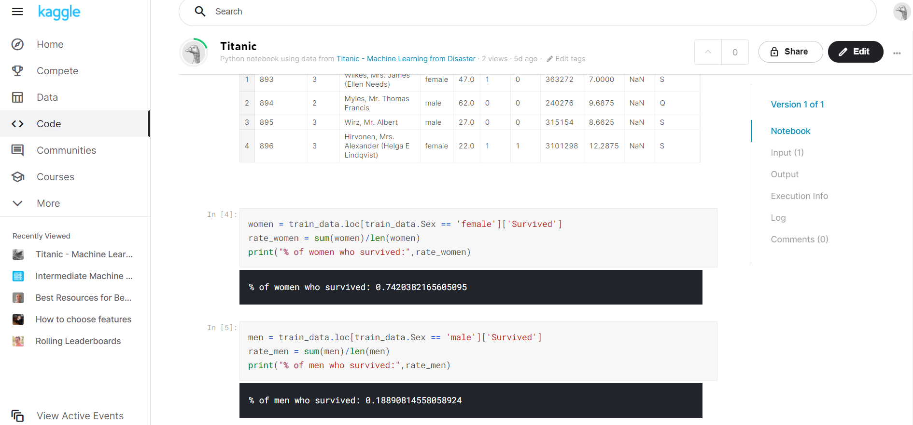

# Sanskar Gupta 
T: (+44) 07459440712 / (+91) 9920068513  
| [Gmail](sanskargupta15@gmail.com) | 
[LinkedIn](https://www.linkedin.com/in/sanskargupta/) | 
[Github](https://github.com/Sanskar-16) | 
[Kaggle](https://www.kaggle.com/sanskar16) | 
[Twitter](https://twitter.com/Sanskar1531) | 

---
## Personal profile    
I am a BSc Data Science student, looking for a placement/internship opportunity. I have dedicated much of my life to community support work and have excellent customer service skills as a result of being a good communicator. I speak three languages and I have extensive programming skills, which I enjoy using for open-sourced coding projects. I have worked on lots of volunteering projects and various jobs throughout my studies at the university.

---
## Education 

### BSc Data Science - University of Essex (2019 - 2023) 
**First-year modules**
- Introduction to programming
- Introduction to databases
- Calculus
- Discrete Mathematics
- Statistics I
- Team project Challenge (Kaggle housing project)(Machine Learning)
- Object-oriented programming 

*Grade Received - 1st (73%)*

**Second-year modules**
- Artificial Intelligence 
- Databases and Information retrieval
- Complex numbers and Matrices
- Statistics II
- Team project challenge (Covid-19 prediction using various regression techniques)
- Math career and employability
- Data structure and algorithms
- Optimisation (Linear programming)
- Survival analysis

*Grade Received - 1st (71%)*

**Third-year modules**
- Natural language engineering(NLP)
- Capstone Project (Opinion forming using Graph theory)
- Modelling Experimental Data
- Applied Statistics 
- Information Retrieval
- Data Visualisation
- Math career and employability.

### A-levels or equivalent - Delhi Public School (2017 - 2019)
**Subject Undertaken**
- Computer Science 
- Physics 
- Maths
- Chemistry 
- English 
- Physical Education 

*Grade Received - 89% (A)*

* * * * * * * *
## Projects worked on 

### 1. [Capstone Project (dissertaion for third year)](https://github.com/Sanskar-16/capstone)

### 2. [Natural Language Engineering](https://github.com/Sanskar-16/NLE-assignment)

### 3. [My own twitter data analysis](https://github.com/Sanskar-16/twitter)

### 4. [My own spotify data analysis](https://github.com/Sanskar-16/spotify)

### 5. [Analysis on F1 data](https://github.com/Sanskar-16/f1)

### 6. [A COVID-19 modelling and forecast tool](https://github.com/Sanskar-16/covid-project)  

- This project was a part of the module CE291 Team project challenge in my second year. The requirements were to create a modelling and forecasting tool using data available online. 
- We used Piecewise linear regression algorithm to predict the graph.
- We have also included a colour-coded map, which shows the number of cases in a region based on colours.
- Another feature that our product entails is the country comparison tab which as the name suggests compares two countries and shows various metrics for their data.

  

  

  

  

Languages used - Java, HTML, Python.

### 7. [House Prices - Advanced Regression Techniques](https://github.com/Sanskar-16/house-price-new)

- This project was based on a prediction of the housing prices using feature engineering, RFs and gradient boosting. The attributes which define the price in a certain way were given, One had to get the right attributes together and remove the ones which alter the price in an undesirable way to predict the prices in the most accurate manner. I did this project with a team of six other members, We all achieved a score of 0.16164 (RMSE) as the best score.  
- RMSE also knows as Root mean square error is the deviation of the residuals, Residuals are a measure of how far from the regression line data points are.
- We initially based our predictions on random forest which is a simple yet diverse machine learning algorithm. Moving forward we realised XGBoost produced better results for us. XGBoost is an implementation of gradient boosted decision trees designed for speed and performance.

- Language/Libraries used - python (pandas, seaborn, matplotlib, NumPy, scipy, sklearn)
- Algorithms used - random forest, XGBoost.

### 8. [Titanic - ML from disaster](https://github.com/Sanskar-16/titanic)

I started this project to gain basic insights into ML and how kaggle works. I achieved a score of 0.775 compared to the best score of 1. The competition uses machine learning to create a model that predicts which passengers survived the Titanic shipwreck. I do plan on improving my score once I learn more algorithms and have a better understanding of the dataset.

Languages/libraries used - Python (pandas, NumPy)

*******
## Work experience  

### Chef (Nov 2021 - Current) 
Ask Italian
- Create and present quality food in accordance with company specs.

### Student Ambassador (October 2021 - current)
University of Essex
- Part of the Communications and External Relations Team.
- Predominately undertaking duties for the Outreach and Marketing and Student Recruitment teams.
- Supporting the above-mentioned teams by providing a current student’s perspective and general assistance at the University’s Outreach and Marketing and Student Recruitment teams.
- At key points throughout the year, supporting other teams across the University on approved, Student 
 Ambassador related activities.
- Outreach events involve working with young people aged 11-18 years and also work specifically with groups of people under-represented at universities, including mature students, students with disabilities and care leavers. At such events, providing positive role models in Higher Education and being committed to the objectives of widening access.
- Working with post-16 students at on-campus events such as pre-application Open Days, Applicant 
 Days and Campus Tours for Marketing and Student Recruitment events.
- Student Ambassadors also importantly work with the parents/guardians of young people and applicants. They may have the opportunity for office-based experience.

### Resident’s Assistant (October 2020 – June 2021)
University of Essex		
- Creating a sense of community through social opportunities and befriending.
- Using admin and organisational skills for facilitating flat agreements
- Problem solving and dialogue within student accommodation using negotiation and listening skills. 
- Building inclusive residential and campus-wide communities and assist in the creation of an environment in which students not only live and learn but also grow.
- Creative thinking to come up with programs with social values for residents, promoting and running those events.
- Mental health awareness.	

### Support Worker	(February 2020 – October 2020)
Lifeways – Living Ambitions
- Working as a support worker by helping the service users carry out their day-to-day tasks.
- Being punctual to relieve colleagues from previous shifts.
- Responsibly help them take their medications correctly and on time.
- Make food with/for them, helps me learn about different people and their interests.
- Working part-time as and when needed by the services I am listed under. Keeps me determined to work better and harder every day.  

### Accommodation representative (October 2019 – July 2020)
University of Essex
- Maintain my own room to show it as a model room for visiting parents and new students.
- Fill in timesheets in a particular time frame to get paid for the shifts held.

### Team Member	(May 2019 - August 2019)
Theobroma - Food of the Gods
- Worked as a Team Member to provide quality service.
- Coordinated with the team to deliver in the best interest of the customer.
- Well Experienced in waiting tables, closing shift, managing orders.
- Responsibly handle cash whenever needed.
- Converse with customers for feedback on the service provided and how can it be improved.

---
## Positions of responsibility

### Vice-President – Cycling club (October 2020 – July 2021)
University of Essex
- Manage the internal working of the club such as and assist the president where necessary.
- Act as a secondary point of contact for external bodies.

### Essex Student representative (December 2019 – July 2020)
University of Essex
- Student representative for mathematical Sciences department’s modules.
- Gather feedback from students via email, WhatsApp for different modules.
- Communicate efficiently with higher authorities to convey the feedback.

---
## Volunteering experience

### Communications Officer (January 2021  – Current)
University of Essex - VTeam (Animal protection project)
- Emailing new volunteers, welcoming them to the project.
- Sending weekly emails to volunteers that are “Ready to Volunteer”, telling them session times, location (Zoom meeting ID for now), etc.
- Changing the status of volunteers on GradIntel.
- Telling Session Leaders who are attending their session.
- Helping with session planning. Sharing completed session plan with session leaders, volunteers, and VTeam.
- Helping to promote the project through stalls/lectures/society socials (mostly on social media right now - Facebook pages, Instagram, etc.)
- Helping in creating promotional material.
- Ensure project descriptions are up-to-date and relevant  

### Session Leader (October 2019  – January 2021)
University of Essex - VTeam (Animal protection project)
- Working as a session leader for the animal protection project on alternate weekends.
- Take attendance on volunteers’ arrival and make sure everyone reaches safely.
- Working as a volunteer on other on and off projects and regular projects.

### Volunteer (October 2019 - Jul 2020)
University of Essex – Nightline
- Confidential listening and support services run by the students for the students at the university.
- Basic first aid/bystander trained.  

### Volunteer (April 2017 - June 2017)
The Akanksha Foundation
- Worked as a Volunteer to align the HR activities in MS Excel during appraisals.
- Helped the team with Employee data and MIS.
- Coordination with the HR team and field Volunteer for organizing an annual day.

---
## Languages:
- English (Fluent) 
- Hindi (Fluent)
- Spanish (Beginner)

## Technical Skills:
- Git (version control), Jira (Project management)
- Programming languages -> Python, MySQL, R, Java, HTML, C++.
- Software Experince - MATLAB, RStudio, Jetbrains softwares, Power BI, Tableau.
- Data Science Platform experience - Kaggle, Github, 
- Conversant with Windows, Mac, MS office & Internet-based applications.

---
## Interests and Activities
- Neural Networks, Computer Vision, Art using ML/AI, Deep Learning, Cloud computing.
- Participating in sports and fitness – helps me keep active and a good physique. I'm passionate about football.
- Listening and working with Music and beats – keeps me relaxed. I play intruments too (keyboard and drums).
- Cycle touring – explore nearby areas, go for long rides.
- Gaming – COD, Chess.

---
## Reference available on request  
